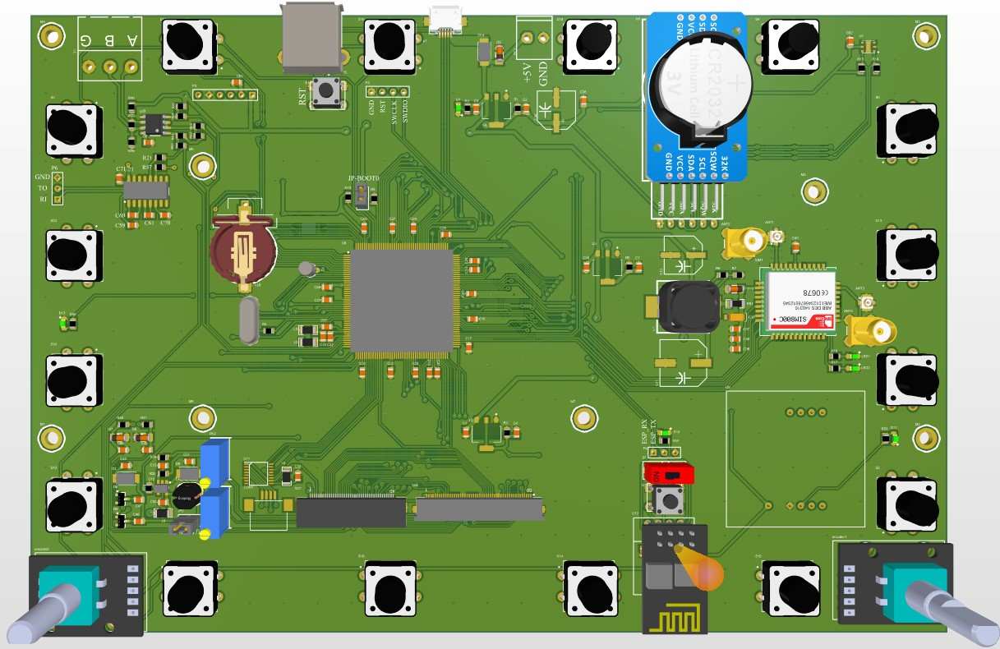
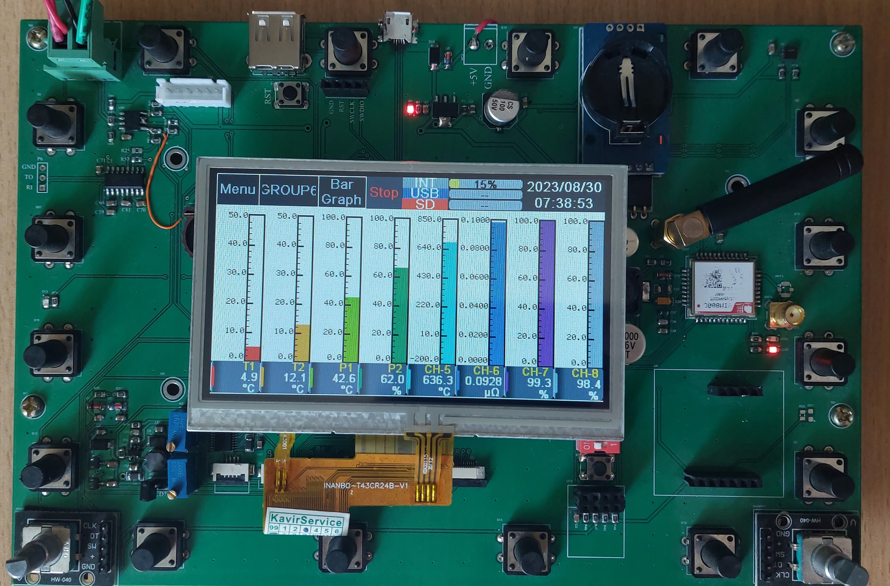
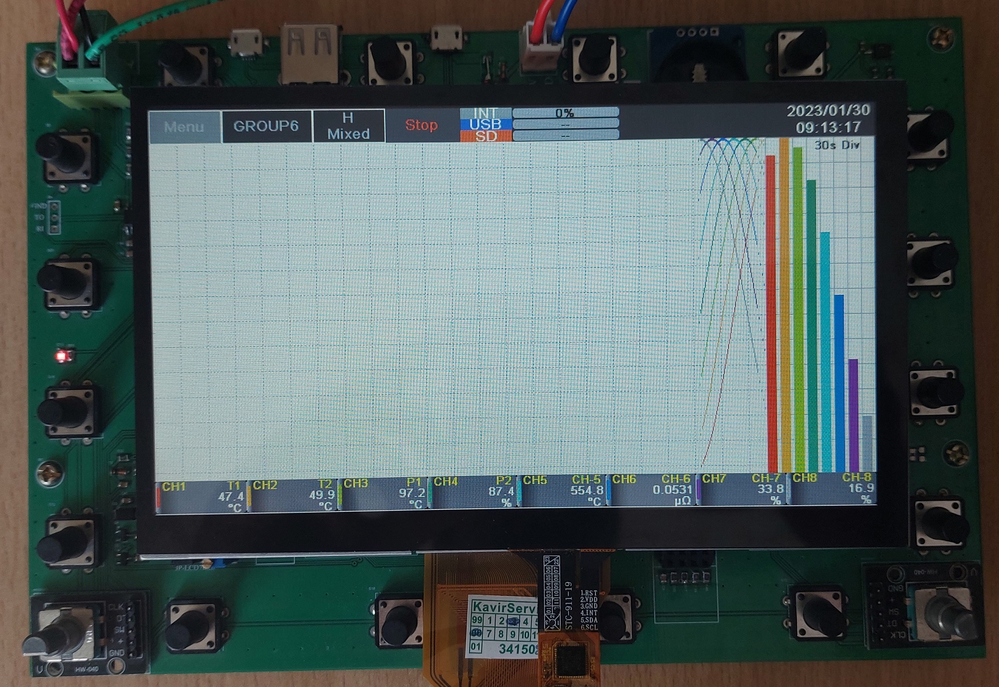

# STM32H743 HMI Board
STM32H7 series with ARM Cortex M7 offers great performance at 550 MHz. With the aid of several high performance peripherals and high capacity internal SRAM and flash memories, it is one of the best choices for making a custom Human Machine Interface.
This PCB is designed around STM32H743IIT6 for driving 4.3" and 7" LCD displays. An external SDRAM with 32 Mbytes capacity connected to microcontroller via high speed FMC bus. Here are some parts that are placed on the board:
- 512 MBytes NAND flash
- Two W25N01 NOR flash
- SIM800c GSM module
- MAX485 and MAX3232
- SD card slot
- Female USB type A connector for connecting USB flash drive and mouse
- DS3231 accurate RTC module
- SHT20 room humidity and temperature sensor
- 16 push buttons and 2 rotary encoders for user input
- XPT2046 resistive touch driver
- ESP8266 wifi module

This board is specifically designed for the implementation of custom GUI and building industrial HMI devices. One 40-pin and one 50-pin FPC connector enable the user to connect two kinds of LCD displays. These two connectors are connected to the same LTDC pins of the microcontroller, so only one LCD can be driven at one time.

4.3" LCD with a resolution of 480 by 272 pixels connected to the board.

7" LCD with the resolution of 800 by 480 pixels connected to the board.

